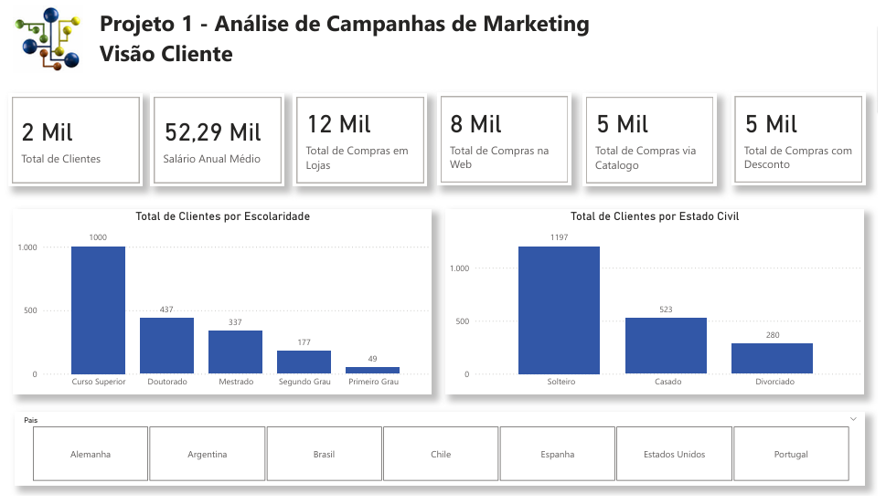
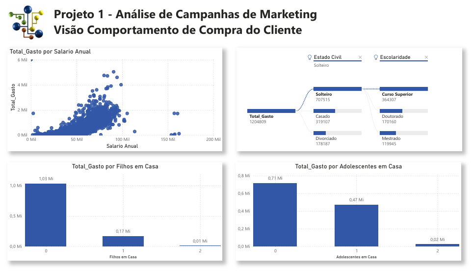
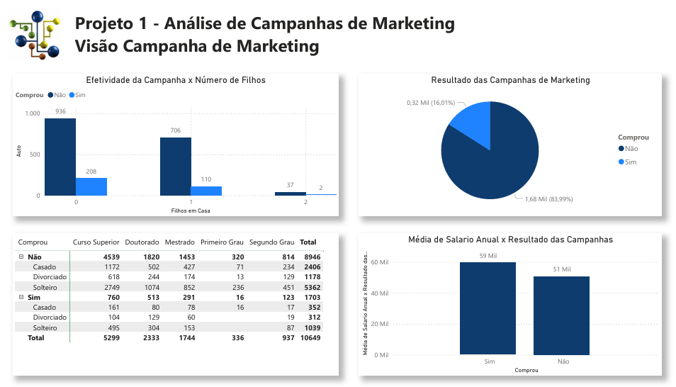

# Projeto 1 - Análise de Campanhas de Marketing com Power BI
Projeto do curso: "Microsoft Power BI Para Business Intelligence e Data Science", por [Data Science Academy](www.datascienceacademy.com.br). 

## Sobre o Dataset
Os dados representam informações sobre clientes e campanhas de Marketing realizadas por uma empresa (Arquivo csv). Neste Projeto será criado relatórios que serão divididos em 4 visões:  
- Visão do Cliente;
- Visão do Comportamento de Compra do Cliente;
- Visão da Performance das Campanhas de Marketing;
- Visão dos Padrões de Compra no Ponto de Venda (País).

## Dataviz - Visão Cliente

 

[Ver Dashboard online, customer view.](https://app.powerbi.com/view?r=eyJrIjoiZWQ2NDNiOTgtMzE5Yy00NThkLWIyODctMmQwNGY3YmM1NDIzIiwidCI6IjY1OWNlMmI4LTA3MTQtNDE5OC04YzM4LWRjOWI2MGFhYmI1NyJ9)
 

## Dataviz - Visão Comportamento de Compra do Cliente

 

## Dataviz - Visão Campanha de Marketing

 

[End]
